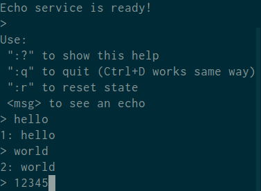
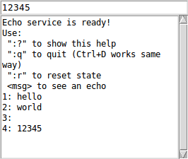

## Dialogui

**Dialogui** - library, providing a simple UI, interacting with user through command line.

### Screenshots

At the moment two "backends" of UI are available:

1. **TUI** (Text User Interface):



2. **Tk**-based **GUI**:



### Installation

```shell
$ stack install
```

### Examples

Example applications with different implementations of UI can be builded this way:
```shell
$ stack build --flag dialogui:buildexamples
```

